# Tech Reviews Website

[View the live website here](http://tech-reviews.herokuapp.com/)

Tech Reviews is a fictitious consumer electronics reviews and consumer advice company based in Manchester, United Kingdom. This is the organisation's main marketing website which aims to inform customers about the different consumer electronics products currently available in the marketplace and persuade them to make a purchase. It provides customers with information and reviews for a variety of products including phones, tablets, laptops, speakers and smart watches. The website is designed to be responsive and easy to navigate on a range of devices.

## User Experience (UX)

### User Stories

1. As a customer or a site owner, I want to be able to navigate the website easily to find the content I am looking for.
2. As a customer, I want to be able to find out about the latest consumer electronics products.
3. As a customer, I want to be able to sign up for email updates about the latest consumer electronics products.
4. As a customer, I want to be able to search for products that meet my needs.
5. As a customer, I want to be able to view product information and read reviews for each product.
6. As a customer, I want to be able to sign in to my account or sign up for an account if I don't already have one. 
7. As a customer, I want to be able to write reviews of products.
8. As a customer, I want to be able to edit and delete my reviews.
9. As a site owner, I want to be able to add, edit and delete products.
10. As a customer, I want to be able to contact the organisation to get answers to any questions I may have.
11. As a customer, I want to be able to find the organisation's social media links.

### Design

#### Colour Scheme

- The three main colours used in the website are black, white, green and grey.
- These colours were chosen because the black/grey contrasts with the green/white.

#### Typography

- The main font used throughout the website is Nunito Sans.
- This font was chosen because it makes the content easy to read.
- Sans Serif is the fallback font which is used in the event that the specified font fails to import into the website correctly.

#### Imagery

- The home page hero image was chosen because it give the user an idea of what kind of products they can find out more about on the site.

- The contact us page hero image was chosen because it adds to the ambiance of the page.

- The product images were chosen because they give the user an idea of what they can expect if they choose to purchase the product.

### Wireframes

- [Desktop](static/wireframes/desktop-wireframes.pdf)
- [Tablet](static/wireframes/tablet-wireframes.pdf)
- [Mobile](static/wireframes/mobile-wireframes.pdf)

## Features

### Existing Features

1. Brand Logo

   - This familiarises users with the organisation's logo and is also a link which the user can access from any page to take them back to the home page.

2. Navigation links

   - These enable users to access the different pages of the website so they can easily find the content they are looking for.

3. Search Bar

    - This enables users to search for products by name or brand.

4. Home Page Hero Image

   - This provides users with an image which gives them an idea of the kind of products they can find out about on the site and a link to the sign up page.

5. Featured Products Carousel

   - This provides users with the product's name, an image and a link to the procuct's page for six of the latest products.

6. Newsletter Sign Up

    - This enables users to sign up to receive updates about the latest products by entering their email address into the form.

7. Reviews Search Results / Product Category Reviews

    - This displays all the products that match the search criteria. For each product, it's name, image, overall rating and price is diaplayed. Each product image is a link to the product's page. 
    - Users can sort the products returned by the search by using the sort by dropdown or filter the products by using the filters in the sidebar (the filters form can be accessed by clicking on the filters button on mobile devices).

8. Product Details

    - This provides users with details of the product including colours, price, capacity, display, processor, memory, graphics, camera and video capabilities, battery life and connectivity.

9. Product Ratings

    - This displays progress bars displaying the average ratings from the reviews for overall rating, performace, usability, price, quality. 
    - Progress bars are also displayed for the percentage of users who rated the product each star rating overall.

10. Product Reviews

    - This enables users to read the reviews that other users have written and vote whether each the review is helpful or not.
    - If the user is signed in, they can write their own review for the product and edit or delete their review if they have already written one by clicking on the relevant links.

11. Add/Edit Review Forms

    - These enable users to add or edit the details of their review.

12. Sign Up Form

    This enables users to sign up for an account by entering their first name, last name, email address and password into the form. It also provides them with an opportunity to sign up to the newsletter.

13. Sign In Form

    - This enables users to sign in to their account by entering their email address and password.

14. Account

    - When a user is signed in, this display's all the reviews the user has written and provides them with links to edit and delete each review.

15. Product Management

    - When an admin user is signed in, this display's all the products currently listed on the site, each product's category and links to edit and delete each product. 
    - Admin users can also add a new product by clicking on the add product link or sort the products by selecting an option from the sort by dropdown.

16. Add/Edit Product Forms

    - These enable admin users to add or edit the product's details.

17. Contact Us Form

    - This enables users to contact the organisation about any questions they may have by completing the form. If a user is signed in, their name and email address are automatically entered into the relevant form fields.

18. Footer Navigation links

    - These enable users to access key different pages of the website so they can easily find the content they are looking for.

19. Social Media links

    - These provide users with links to the different social media platforms where the organisation has a presence.

20. Responsive Design

    - Bootstrap grids and CSS media queries are used throughout the website to ensure that it is optimised for use on devices with a wide range of screen sizes.

### Features Left to Implement

1. More Products and Categories

   - Add more products including from additional categories.

2. Add Expert Reviews

    - Add reviews to product details pages written by Subject Matter Experts

3. Add an Offers Page

    - Add an offers page which details the latest offers and provides customers with links to partners' sites where they can purchase the product.

4. One Review Per Product

    - Add functionality to prevent users from being able to write multiple reviews for the same product.

5. Sort Reviews by Ratings or Date Written

    - Add a dropdwon to the product details pages to give users the option to sort the reviews by ratings or date written.

6. 5 More Reviews and Show All Reviews Buttons

    - Add buttons to the product details pages to display 5 more reviews or show all reviews.

## Technologies Used

### Languages Used

1. [HTML5:](https://en.wikipedia.org/wiki/HTML5/)
   - HTML5 was used for the sturcture of the webpages.
2. [CSS3:](https://en.wikipedia.org/wiki/Cascading_Style_Sheets/)
   - CSS3 was used for the styling of the webpages.
3. [JavaScript:](https://en.wikipedia.org/wiki/JavaScript/)
   - JavaScript was used for the interactive features on the webpages.
4. [Python:](https://www.python.org/)
    - Python was used to communicate the database information to the browser.

### Frameworks, Libraries & Programs Used

1. [Bootstrap 4.5](https://getbootstrap.com/)
   - Bootstrap was used for the navbar, footer accordion, toasts, forms, buttons, filters modal, sort by dropdown buttons, featured products carousel cards and reviews cards. Bootstrap was also used for the grid which assists with the responsiveness of the website and for the styling.
2. [Hover.css](https://ianlunn.github.io/Hover/)
   - Hover.css was used for the hover effects on the social media icons.
3. [Font Awesome](https://fontawesome.com/)
   - Font Awesome was used throughout the website to enhance the user experience by adding icons.
4. [Popper.js](https://popper.js.org/)
   - Bootstrap uses Popper.js to make the navbar responsive.
5. [jQuery](https://jquery.com/)
   - JQuery was used throughout the website for the interactive features.
6. [Slick Slider](https://kenwheeler.github.io/slick/)
    - Slick Slider was used for the featured products carousel. License is [here](slick_license.md).
7. [Flask](https://flask.palletsprojects.com/en/1.1.x/)
   - Flask was used for the routing of the appliction and for the messages.
8. [Flask Paginate](https://pythonhosted.org/Flask-paginate/)
   - Flask Paginatie was used for the pagination on the reviews, category reviews and product management pages.
9. [Jinja](https://jinja.palletsprojects.com/en/2.11.x/)
   - Jinja was used for the templating.
10. [Flask-PyMongo](https://flask-pymongo.readthedocs.io/en/latest/)
    - Flask-PyMongo was used to interact with the database. 
11. [MongoDB](https://owlcarousel2.github.io/OwlCarousel2/)
    - A MongoDB database was used to store the data used in the project.
12. [Gitpod](https://www.gitpod.io/)
    - Gitpod was used to write the code for this project and gitpod terminal was used to commit changes to Git and Push them to GitHub.
13. [Git](https://git-scm.com/)
    - Git was the version control system used for this project.
14. [GitHub](https://github.com/)
    - GitHub is used to store the project's code and any other required files.
15. [Heroku](https://www.heroku.com/)
    - Heroku is used to host the deployed website.
16. [Balsamiq](https://balsamiq.com/)
    - Balsamiq was used to create the wireframes during the design phase of the project.

## Testing

### WC3 Validation

The W3C Markup Validator and W3C CSS Validator Services were used to validate every page of the website to ensure that the code used was in compliance with the HTML5 and CSS3 standards and that there were no syntax errors.

- [Home]()
- [Reviews / Category Reviews]()
- [Product Details]()
- [Add Review]()
- [Edit Review]()
- [Register]()
- [Sign In]()
- [Sign Out]()
- [Account]()
- [Product Management]()
- [Add Product]()
- [Edit Product]()
- [403]()
- [404]()
- [CSS]()

### Testing User Stories from User Experience (UX) Section

1. As a customer or a site owner, I want to be able to navigate the website easily to find the content I am looking for.

    - The navigation bar can be easily accessed in the header of each page. 
    - It is clean and easy to read and contains the organisation's logo and the navigation links to the other pages of the website.
    - Each of the navigation links clearly communicates to the user what page it will take them to.
    - The Tech Reviews brand logo is also a link which takes the user back to the home page.
    - The footer also contains key links which take the user to the category reviews pages, contact page and either the account page (standard users) or product management page (admin users) if the user is signed in.
    - The website is structured in a logical way with the hero image, featured products carousel and newsletter sign up on the home page, and each other item of content on it's own page.

2. As a customer, I want to be able to find out about the latest consumer electronics products.

    - The featured products carousel is clearly highlighted on the home page.
    - This contains information about the latest products including an image of each product which links to it's page, and it's name. Users can find out more about the product, view it's ratings and read user reviews on the product's page.

3. As a customer, I want to be able to sign up for email updates about the latest consumer electronics products.

    - The newsletter sign up section is clearly highlighted on the home page.
    - This contains a form where users can enter their email address to sign up to receive email updates about the latest products.

4. As a customer, I want to be able to search for products that meet my needs.

    - The search bar is clearly highlighted in the navigation bar in the header of each page. Here users can enter a product name or brand to search for products.
    - The reviews dropdown is clearly highlighted in the navigation bar in the header of each page. Here users can select a product category which will search for all of the products in the category.
    - Users can sort the products by selecting an option from the sort by dropdown.
    - Users can further refine their search by selecting options from the filters form in the sidebar. On mobile devices, users can access the filters form by clicking on the filters button.
    - For each product that satisfies the user's search criteria, an image of the product which links to it's page, it's name, it's price and it's average user rating is displayed.

5. As a customer, I want to be able to view product information and read reviews for each product.

    - Users can access a product's page by clicking on a product image on the reviews search results or category reviews pages.
    - Here the user can find information about the product including it's colours, price, capacity, display, processor, memory, graphics, camera and video capabilities, battery life and connectivity.
    - They can also view the product's average ratings for performace, usability, price and quality, and the percentage of users who rated the product each star rating overall.
    - User reviews are also available for the users to read and rate whether they were helpful or not on the product page.

6. As a customer, I want to be able to sign in to my account or sign up for an account if I don't already have one. 

    - Users can access the sign in / register links by clicking on the user dropdown (large screens and above) or by clicking on the relevant links in the navigation bar (small and medium screens). There are also links to the sign in / register pages in the footer.
    - On the sign in page, users can sign in to their account.
    - On the register page, users can sign up for an account if they haven't already registered for one.

7. As a customer, I want to be able to write reviews of products.

    - The add review link is clearly highlighted on the product pages when the user is signed in.
    - If the user clicks on this link, they are taken to the add review form which they can complete to add a review for the product.

8. As a customer, I want to be able to easily access my reviews to edit and delete them.

    - Users can access their reviews by clicking on the user dropdown and selecting the account option (large screens and above) or by clicking on the account link in the navigation bar (small and medium screens). There is also a link to the account page in the footer.
    - Here, users can find cards for all of the reviews they have written which include links to the edit and delete the review. 
    - Users can also find links to edit and delete their reviews in the review card on the relevant product page.
    - When a user clicks on the edit link, they are taken to the edit review form where they can amend the details of their review.
    - When a user clicks on the edit link, their review is deleted.

9. As a site owner, I want to be able to add, edit and delete products.

    - Site owners can access the product management page by clicking on the user dropdown and selecting the product management (large screens and above) or by clicking on the product management link in the navigation bar (small and medium screens). There is also a link to the product management page in the footer.
    - Here, site owners can find a table containing all of the products that are currently listed on the site. Each product's row displays the product's name, category, and links to the edit and delete the product. 
    - When a site owner clicks on the edit link, they are taken to the edit product form where they can amend the relevant product details.
    - When a site owner clicks on the delete link, the product is deleted.
    - Site owners can can add a new product by clicking on the add product link which takes them to the add product form.

10. As a customer, I want to be able to contact the organisation to get answers to any questions I may have.

    - A link to the contact us page is clearly highlighted in the navigation bar and in the footer.
    - Here there is a form which the user can complete to get in touch with the organisation.

11. As a customer, I want to be able to find the organisation's social media links.

    - The social media icons are clearly highlighted in the footer of each page.
    - Each of these provides a link to the relevant social media platform.

### Manual Testing

Details of the manual testing carried out can be viewed [here](testing.md).

### Further Testing

- The Website was tested on a variety of different web browsers including Google Chrome, Microsoft Edge, Safari and Firefox.
- The Website was also viewed on a number of different devices with a range of screen widths including an iMac, MacBook, iPad and iPhone.
- Family and friends were asked to review the site and documentation and identify any bugs or other issues that were affecting the user experience.

### Fixed Bugs

1. Signed in users were unable to add, edit or delete reviews

    - Fixed an issue in the code causing only admin users to be able to add, edit or delete reviews.

2. Invalid newsletter signup and contact forms were able to be submitted 

    -  Added jQuery to check the form was valid before submitting.

3. Register form was able to be submitted if password and confirm password did not match as long as they matched the specified pattern.

    - Added jQuery to check the password and confirm password matched before submitting.

4. Add review and edit review forms did not return the user to the product page when the form was successfully submitted.

    - Added the product page URL to the add review and edit review forms as a hidden field and amended the relevant flask views to return to this URL when the form was successfully submitted.

5. Edit and delete review links were not appearing in the correct place when the review title was on 2 lines.

    - Amended the HTML and CSS of the cards to fix the links in the top right of the cards and wrap the text around them.

## Deployment

### Heroku

The project was deployed to Heroku using the following steps:

1.  Log in to Heroku and click on the "New" button.
    
2.  Click on the "Create new app" button in the dropdown list.
    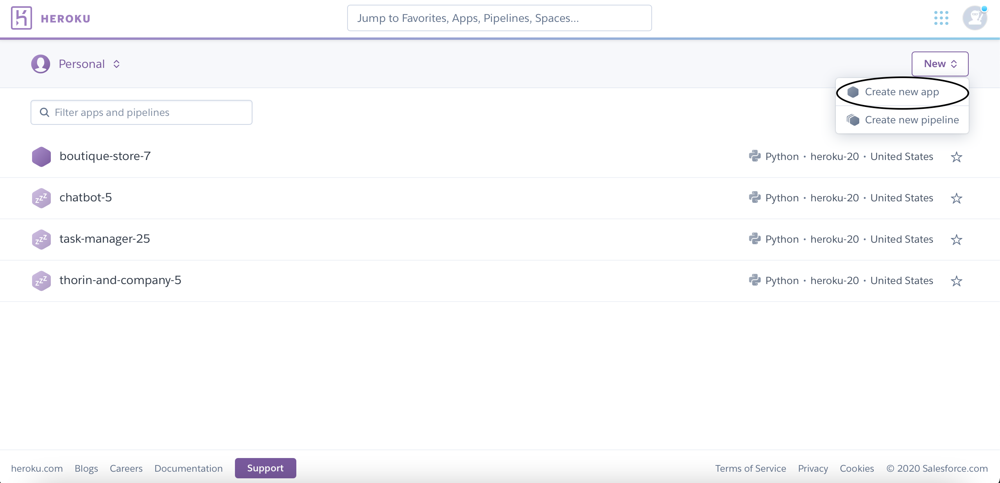
3.  Enter a name for the app and check that it is available.
    
4.  Click the "Create app" button.
    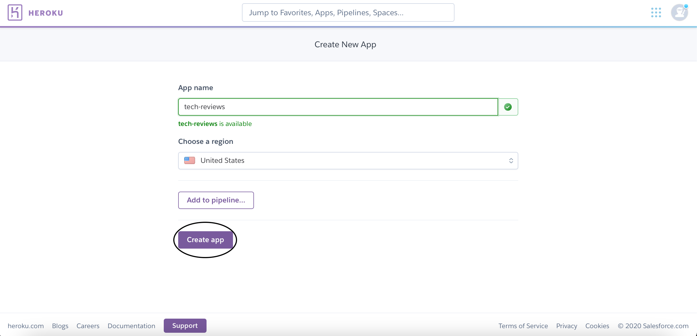
5.  Scroll down to the connect to GitHub section, enter the project's GitHub repository name in the repo-name field and click the "Search" button.
    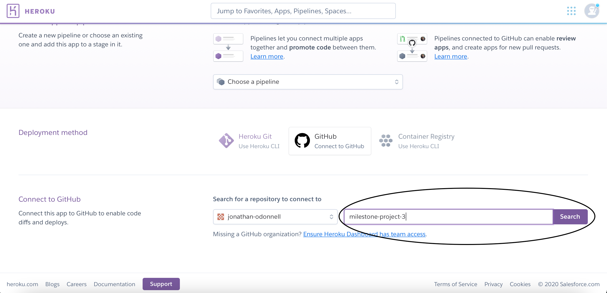
6.  Click the "Connect" button next to the GitHub repository.
    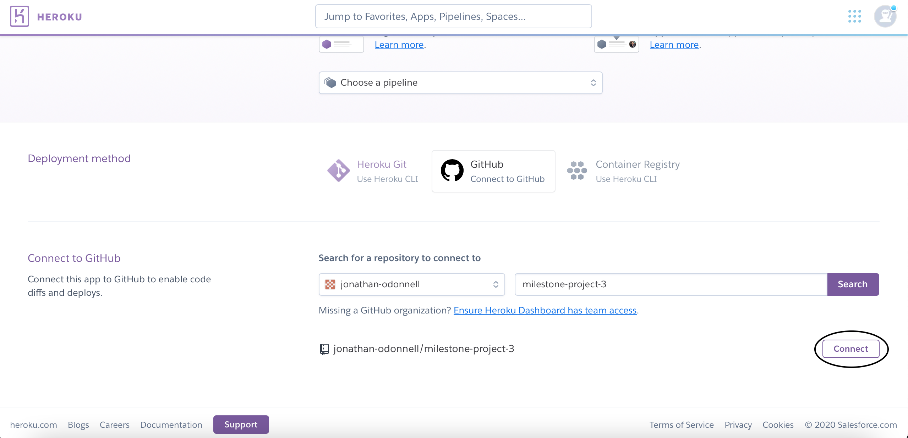
7.  Scroll down to the automatic deploys section and click the "Enable Automatic Deploys" button.
    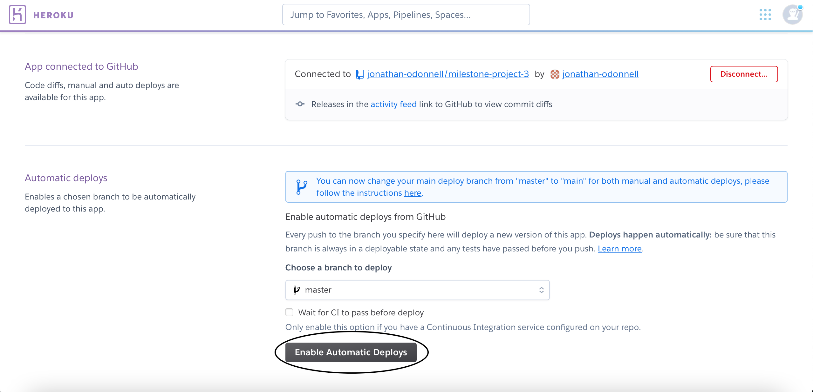
8.  Scroll back up to the top of the page and click the "Settings" tab.
    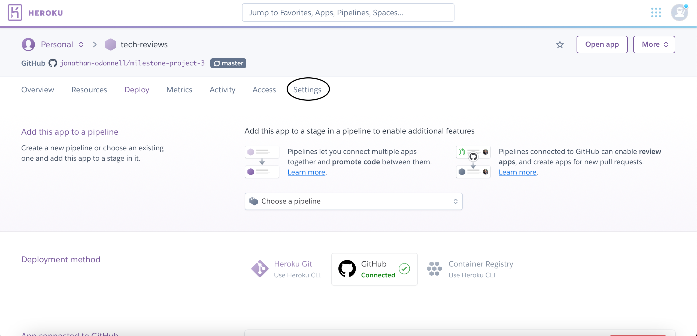
9.  Scroll down to the convig vars section and click the "Reveal Config Vars" button.
    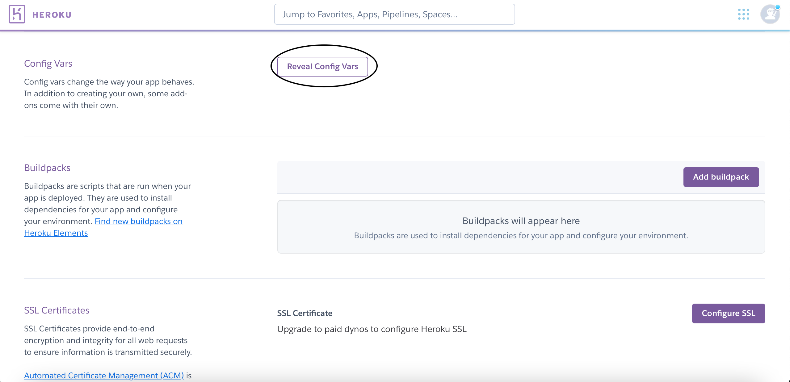
10. Enter the key and value for each config var and click the "add" button.
    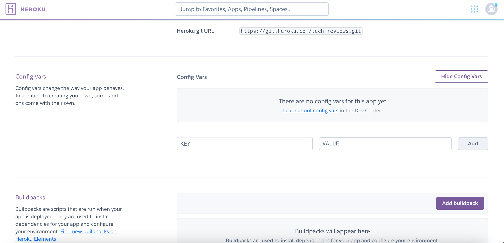

More information about deploying a website to Heroku is available [here](https://devcenter.heroku.com/categories/deployment).

### Forking the GitHub repository

The GitHub Repository can be forked using the following steps:

1.  Log in to GitHub and locate the project's [GitHub Repository](https://github.com/jonathan-odonnell/milestone-project-3).
2.  At the top-right of the repository, click the "Fork" Button.
    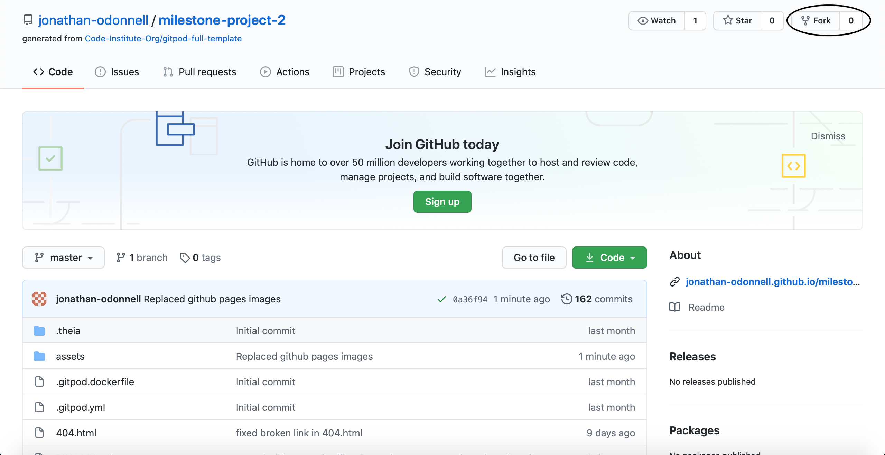

More information about forking a GitHub repository is available [here](https://docs.github.com/en/github/getting-started-with-github/fork-a-repo).

### Making a Local Clone

A local clone of the project can be created using the following steps:

1.  Log in to GitHub and locate the project's [GitHub Repository](https://github.com/jonathan-odonnell/milestone-project-3).
2.  Under the repository name, click the "Code" button.
    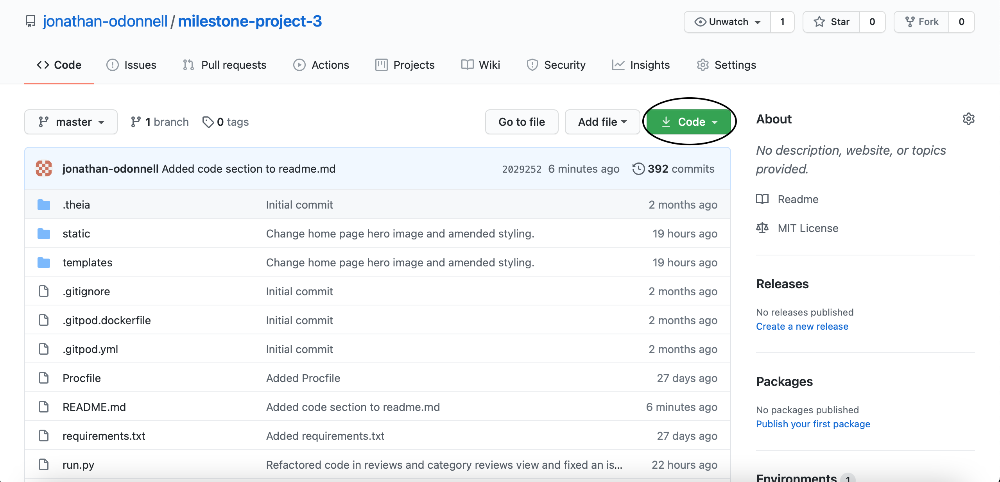
3.  To clone the repository using HTTPS, under "Clone with HTTPS", click the clipboard button to copy the repository URL.
    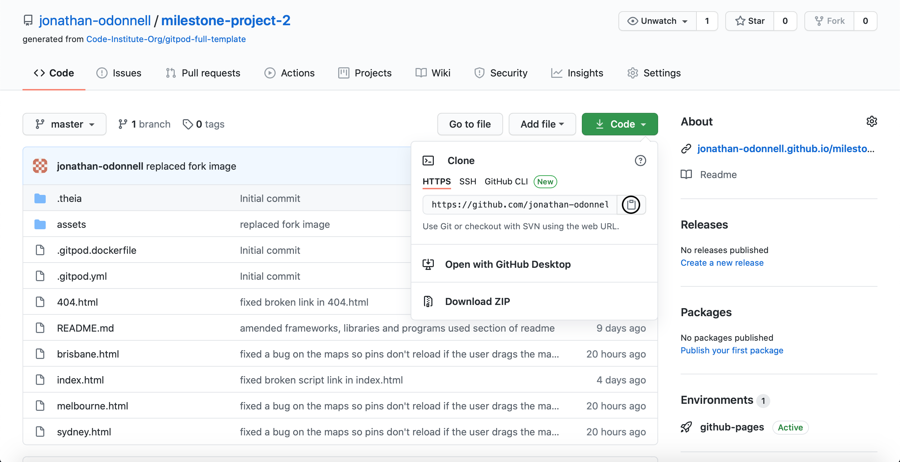
    To clone using SSH click "Use SSH" and then click the clipboard button.
    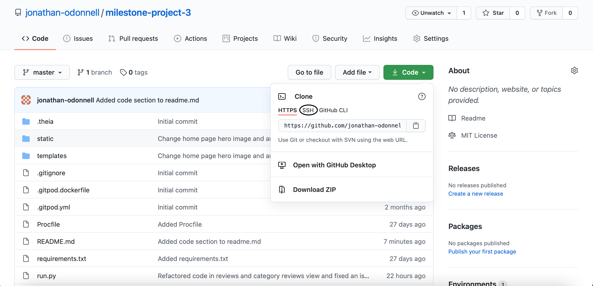
    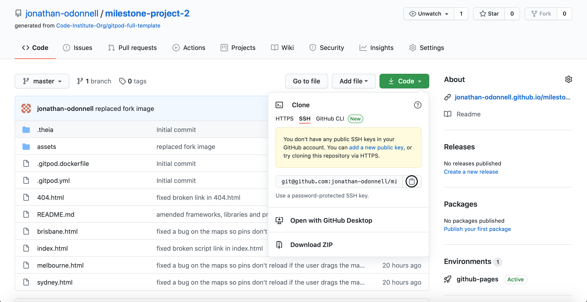
4.  Open Git Bash
5.  Change the current working directory to the location where you want to store the cloned repository.
6.  Type `git clone` and then paste the URL you copied in Step 3.

```
$ git clone https://github.com/jonathan-odonnell/milestone-project-3.git
```

7.  Press enter to create your clone.

```
Cloning into 'milestone-project-3'...
remote: Enumerating objects: 1900, done.
remote: Total 1900 (delta 0), reused 0 (delta 0), pack-reused 1900
Receiving objects: 100% (1900/1900), 74.54 MiB | 4.68 MiB/s, done.
Resolving deltas: 100% (1290/1290), done.
```

More information about making a local clone of a GitHub repository is available [here](https://docs.github.com/en/github/creating-cloning-and-archiving-repositories/cloning-a-repository).

## Credits

### Code

- Code for the navbar came from [Bootstrap](https://bootswatch.com/lux/).
- Code for the navbar toggler bars icon came from [Font Awesome](https://fontawesome.com/icons/bars?style=solid).
- Code for the navbar toggler times icon came from [Font Awesome](https://fontawesome.com/icons/times?style=solid).
- Code for the search icon came from [Font Awesome](https://fontawesome.com/icons/search?style=solid).
- Code to add search icon on to the end of the search field came from [Bootstrap](https://getbootstrap.com/docs/5.0/forms/input-group).
- Code for the collapsable search field and collapsable navbar came from [Bootstrap](https://getbootstrap.com/docs/4.5/components/collapse/).
- Code for the user icon came from [Font Awesome](https://fontawesome.com/icons/user?style=solid).
- Code for the toasts is from [Bootstrap](https://getbootstrap.com/docs/4.5/components/toasts/).
- Code for the icon sizing is from [Font Awesome](https://fontawesome.com/how-to-use/on-the-web/styling/sizing-icons).
- Code for the toast arrow up is adapted from [CSS Tricks](https://css-tricks.com/snippets/css/css-triangle/).
- Code for the dropdowns came from [Bootstrap](https://getbootstrap.com/docs/4.5/components/dropdowns/).
- Code for the Facebook icon is from [Font Awesome](https://fontawesome.com/icons/facebook?style=brands).
- Code for the Twitter icon is from [Font Awesome](https://fontawesome.com/icons/twitter?style=brands).
- Code for the Instagram icon is from [Font Awesome](https://fontawesome.com/icons/instagram?style=brands).
- Code for the Youtube icon is from [Font Awesome](https://fontawesome.com/icons/youtube?style=brands).
- Code for the social media icon hover effects is from [Hover.css](https://ianlunn.github.io/Hover/).
- Code for the plus icon is from [Font Awesome](https://fontawesome.com/icons/plus?style=solid).
- Code for the minus icon is from [Font Awesome](https://fontawesome.com/icons/plus?style=solid).
- Code for the featured products carousel is from [Slick Slider](https://kenwheeler.github.io/slick/).
- Code for the email address and password patterns are from [w3schools](https://www.w3schools.com/tags/att_input_pattern.asp).
- Code for the next url hidden form field is from [tecladocode](https://blog.tecladocode.com/handling-the-next-url-when-logging-in-with-flask).
- Code for setting the confirm password field to invalid if it's value doesn't match the value of the password field is from [codepen](https://codepen.io/diegoleme/pen/surIK).
- Code for preventing the default behaviour of the submit button is from [Stack Overflow](https://stackoverflow.com/questions/9824808/disable-form-auto-submit-on-button-click/9825224)
- Code for reporting the validity of form fields is from [Mozilla](https://developer.mozilla.org/en-US/docs/Web/API/HTMLFormElement/reportValidity).
- Code for edit icon is from [Font Awesome](https://fontawesome.com/icons/edit?style=solid).
- Code for trash icon is from [Font Awesome](https://fontawesome.com/icons/trash?style=solid).
- Code for the tables is from [Bootstrap](https://getbootstrap.com/docs/4.5/content/tables/).
- Code for the pagination is from [Flask Paginate](https://pythonhosted.org/Flask-paginate/).
- Code for form styling and switch element is from [Bootswatch](https://bootswatch.com/lux/).
- Code for the filters form modal is from [Bootstrap](https://getbootstrap.com/docs/4.5/components/modal/).
- Code for the product price and average rating styling on the reviews / category reviews page is from [Bootstrap](https://getbootstrap.com/docs/4.5/utilities/colors/#color).
- Code for the full star icon is from [Font Awesome](https://fontawesome.com/icons/star?style=solid).
- Code for the empty star icon is from [Font Awesome](https://fontawesome.com/icons/star?style=regular).
- Code for the ratings siders is from [Font Awesome](https://fontawesome.com/icons/sliders-h?style=solid).
- Code for ratings star radio button styling is from [Codepen](https://codepen.io/hesguru/pen/BaybqXv)
- Code for the includes templating is from [Stack Overflow](https://stackoverflow.com/questions/22860085/how-do-i-include-a-html-file-in-a-jinja2-template).
- Code for the chevron left icon is from [Font Awesome](https://fontawesome.com/icons/chevron-left?style=solid).
- Code for the progress bars is from [Bootswatch](https://bootswatch.com/lux/).
- Code for the thumbs up icon code is from [Font Awesome](https://fontawesome.com/icons/thumbs-up?style=regular).
- Code for the thumbs up solid icon code is from [Font Awesome](https://fontawesome.com/icons/thumbs-up?style=solid).
- Code for the thumbs down icon code is from [Font Awesome](https://fontawesome.com/icons/thumbs-down?style=regular).
- Code for the thumbs down solid icon code is from [Font Awesome](https://fontawesome.com/icons/thumbs-down?style=solid).
- Code for disabling the thumbs up and thumbs down buttons using jQuery is from [Stack Overflow](https://stackoverflow.com/questions/23597913/disable-button-after-click-in-jquery).
- Code for getting the ID of an element using jQuery is from [Stack Overflow](https://stackoverflow.com/questions/3239598/how-can-i-get-the-id-of-an-element-using-jquery).
- Code for the marked map icon is from [Font Awesome](https://fontawesome.com/icons/map-marked-alt?style=solid).
- Code for the envelope icon is from [Font Awesome](https://fontawesome.com/icons/envelope?style=solid).
- Code for the mobile icon is from [Font Awesome](https://fontawesome.com/icons/mobile-alt?style=solid).
- Code for the horizontal and vertical center alignment of the contact us page heading is from [CSS Tricks](https://css-tricks.com/centering-css-complete-guide/).
- Code for adding a search perameter to a URL in the templating is from [Stack Overflow](https://stackoverflow.com/questions/51783658/url-for-creates-a-url-query-string-with-amp)
- Code for the current URL is from [Stack Overflow](https://stackoverflow.com/questions/15974730/how-do-i-get-the-different-parts-of-a-flask-requests-url).
- Code for the previous URL is from [Stack Overflow](https://stackoverflow.com/questions/39777171/how-to-get-the-previous-url-in-flask/39777426).
- Code for local storage is from [Mozilla](https://developer.mozilla.org/en-US/docs/Web/API/Window/localStorage).
- Code for current URL is from [Mozilla](https://developer.mozilla.org/en-US/docs/Web/API/Window/location). 
- Code for a new url object is from [Mozilla](https://developer.mozilla.org/en-US/docs/Web/API/URL/URL).
- Code for adding, updating and deleting search perameters is from [Mozilla](https://developer.mozilla.org/en-US/docs/Web/API/URL/searchParams).
- Code for replacing the URL and reloading the page is from [Mozilla](https://developer.mozilla.org/en-US/docs/Web/API/Location/replace).
- Code for calculating dimensions in CSS is from [Mozilla](https://developer.mozilla.org/en-US/docs/Web/CSS/calc()).
- Code for the pagination perameters is from [GitHub](https://gist.github.com/mozillazg/69fb40067ae6d80386e10e105e6803c9).
- Code for database query greater than or equal to is from [MongoDB](https://docs.mongodb.com/manual/reference/operator/aggregation/gte/).
- Code for database query less than or equal to is from [MongoDB](https://docs.mongodb.com/manual/reference/operator/aggregation/lte/)
- Code for database search by items in a list is from [MongoDB](https://docs.mongodb.com/manual/reference/operator/aggregation/in/).
- Code for sorting a database search results is from [MongoDB](https://stackoverflow.com/questions/8109122/how-to-sort-mongodb-with-pymongo).
- Code for specifying which fields to return in a database search is from [MongnDB](https://docs.mongodb.com/manual/tutorial/project-fields-from-query-results/).
- Code for round method is from Round function is from [Programiz](https://www.programiz.com/python-programming/methods/built-in/round).
- Code for incrementing a database field is from [MongoDB](https://docs.mongodb.com/manual/reference/operator/update/inc/).
- Code for the login_required and admin_required wrappers is from [Flask](https://flask.palletsprojects.com/en/1.1.x/patterns/viewdecorators/).
- Code to return a success status in flask is from [Stack Overflow](https://stackoverflow.com/questions/26079754/flask-how-to-return-a-success-status-code-for-ajax-call/26080784#26080784).
- Code for getting the search Parameters is from [Kite](https://www.kite.com/python/answers/how-to-get-parameters-from-a-url-using-flask-in-python).
- Code for the datetime method is from [w3schools](https://www.w3schools.com/python/python_datetime.asp).
- Code for message categories is from [Flask](https://flask.palletsprojects.com/en/1.1.x/patterns/flashing/).
- Code for counting the number of results that match a database query is from [MongoDB](https://docs.mongodb.com/manual/reference/method/db.collection.count/).
- Code for updating one document in the database is from [MongoDB](https://docs.mongodb.com/manual/reference/method/db.collection.updateOne/).
- Code for aborting a http request and returning a status code in flask is from [MongoDB](https://flask.palletsprojects.com/en/1.1.x/api/#flask.abort).
- Code for removing empty dictionary entries is from [Stack Overflow](https://stackoverflow.com/questions/6307394/removing-dictionary-entries-with-no-values-python).
- Code for adding an item to a list in the database if it is not already in the list is from [MongoDB](https://docs.mongodb.com/manual/reference/operator/update/addToSet/)
- Code for converting a number to the decimal128 data type is from [PyMongo](https://pymongo.readthedocs.io/en/stable/api/bson/decimal128.html)
- Code for deleting an item from a list in the database is from [MongoDB](https://docs.mongodb.com/manual/reference/operator/update/pull/)
- Code for handling error status codes is from [Flask](https://flask.palletsprojects.com/en/1.1.x/patterns/errorpages).

### Content

- The product information was from [Amazon](https://www.amazon.co.uk), [Apple](https://www.apple.com), [Dell](https://www.dell.com), [Hewlett Packard](https://www.hp.com) and [Microsoft](https://www.microsoft.com).
- The reviews were from [Amazon](https://www.amazon.co.uk) and [BestBuy](https://www.bestbuy.com)

### Media

- The brand logo was designed using [Hatchful](https://hatchful.shopify.com/).
- The home page hero image was from [Pexels](https://www.pexels.com/photo/group-of-people-standing-beside-body-of-water-2672979/).
- The sign up page hero image was from [Pexels](https://www.pexels.com/photo/woman-in-yellow-sweater-holding-silver-ipad-3979198/).
- The iPhone 12 Pro image was from [Unsplash](https://unsplash.com/photos/TpXoTb1uR5A).
- The iPhone 12 image was from [Unsplash](https://unsplash.com/photos/m1YdCuCQDvQ).
- The Samsung Galaxy S20 image was from [Unsplash](https://unsplash.com/photos/WRYcubOK9tc).
- The Samsung Galaxy S20 Plus image was from [Unsplash](https://unsplash.com/photos/jcJFOwBTEck).
- The Samsung Galaxy S20 Ultra image was from [Unsplash](https://unsplash.com/photos/Ggw9TkdrAA0).
- The Google Pixel 5 image was from [Unsplash](https://unsplash.com/photos/Z9fW8Nn7D24).
- The OnePlus 8T image was from [Unsplash](https://unsplash.com/photos/lEeflIFJTFI).
- The OnePlus Nord image was from [Unsplash](https://unsplash.com/photos/K5scVK5uHNA).
- The iPad Pro (11 inch) image was from [Unsplash](https://unsplash.com/photos/DDEOxavdeIk).
- The iPad Pro (12.9 inch) image was from [Unsplash](https://unsplash.com/photos/MCzoo60m-Nw).
- The iPad Air image was from [Unsplash](https://unsplash.com/photos/RgXO6LZbZgg).
- The Surface Pro X image was from [Unsplash](https://unsplash.com/photos/y5G-f9qnUTc).
- The Surface Pro 7 image was from [Wikipedia](https://commons.wikimedia.org/wiki/File:2019_02_Microsoft_Surface_Pro_2017_with_signature_type_cover.jpg).
- The Surface Go 2 image was from [Unsplash](https://unsplash.com/photos/xmVM5GGJPKc).
- The Samsung Galaxy Tab 7 image was from [Unsplash](https://unsplash.com/photos/Pn9t7RNZYVw).
- The iPad Mini image was from [Unsplash](https://unsplash.com/photos/pVt9j3iWtPM).
- The MacBook Pro (13 inch) image was from [Unsplash](https://unsplash.com/photos/paSLTZpHCdo).
- The MacBook Pro (16 inch) image was from [Unsplash](https://unsplash.com/photos/vUjJztdX4H0).
- The Microsoft Surface Laptop (13 inch) image was from [Unsplash](https://unsplash.com/photos/hddtUR3hhJE).
- The Macbook Air image was from [Unsplash](https://unsplash.com/photos/JYoWTJMJNFo).
- The Microsoft Surface Laptop Go image was from [Unsplash](https://unsplash.com/photos/C6T6vr1sQI0).
- The Dell XPS 2-in-1 (13 inch) image was from [Unsplash](https://unsplash.com/photos/Gi3iUJ1FwxI).
- The HP Spectre x360 (13 inch) image was from [Unsplash](https://unsplash.com/photos/tqWIGez5AsI).
- The Google Pixelbook Go image was from [Unsplash](https://unsplash.com/photos/zwsHjakE_iI).
- The Apple Watch SE image was from [Unsplash](https://unsplash.com/photos/WLXTOvDKuRQ).
- The Apple Watch 5 image was from [Unsplash](https://unsplash.com/photos/bFzhdm9zZp0).
- The Apple Watch 6 image was from [Unsplash](https://unsplash.com/photos/z2GEGmFEhZo).
- The Apple HomePod Mini image was from [Unsplash](https://unsplash.com/photos/lZCHy8PLyyo).
- The Google Nest Mini image was from [Unsplash](https://unsplash.com/photos/UK29635SS6E).
- The Amazon Echo Dot was from [Unsplash](https://unsplash.com/photos/nGzvZe1iWOY).
- The Samsung Galaxy Watch 3 image was from [Pixabay](https://pixabay.com/photos/samsung-galaxy-watch-wearable-3818707).
- The Samsung Galaxy Watch Active 2 image was from [Unsplash](https://unsplash.com/s/photos/samsung-galaxy-watch).
- The contact us page hero image was from [Pexels](https://www.pexels.com/photo/concentrated-businesswoman-talking-on-smartphone-on-street-5669626/).